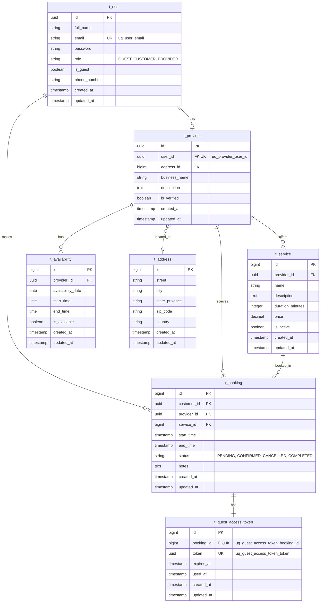

# Bookora

Modern booking system for personal services

## Tech Stack

- **Java 21**
- **Spring Boot 3.5.6**
- **Spring Security** - Authentication & Authorization
- **Spring Data JPA** - Data access layer
- **PostgreSQL** - Primary database
- **Flyway** - Database migrations
- **MapStruct** - Object mapping
- **Lombok** - Boilerplate code reduction
- **Hypersistence Utils** - Hibernate utilities
- **JWT (JJWT)** - Token-based authentication
- **Springdoc OpenAPI** - API documentation
- **Maven** - Build tool

## Prerequisites

- Java 21 or higher
- Maven 3.8+
- PostgreSQL 17

## Database Schema (ERD)



### Key Relationships

- **User-Provider**: One-to-one relationship. A user can become a provider.
- **User-Booking**: One-to-many. A customer (user) can make multiple bookings.
- **Provider-Service**: One-to-many. A provider offers multiple services.
- **Provider-Booking**: One-to-many. A provider receives multiple bookings.
- **Provider-Availability**: One-to-many. A provider defines multiple availability time.
- **Provider-Address**: Many-to-one. Multiple providers can share the same address (co-working spaces, business centers).
- **Service-Booking**: One-to-many. A service can be booked multiple times.
- **Booking-GuestAccessToken**: One-to-one. Each booking can have a guest access token.

### Notes

- **Address**: Separate entity table for reusability, historical tracking, and efficient querying
  - Multiple providers can share the same address (co-working spaces, business centers)
  - Enables address history tracking via BaseEntity timestamps
  - Supports efficient location-based queries with indexed city/country columns
- **UserRole**: Enum (GUEST, CUSTOMER, PROVIDER)
- **BookingStatus**: Enum (PENDING, CONFIRMED, CANCELLED, COMPLETED)
- **Naming Conventions**:
  - Tables: `t_<entity>` prefix
  - Columns: `snake_case`
  - Boolean columns: `is_<name>` prefix
  - Timestamp columns: `<action>_at` suffix
  - Unique constraints: `uq_<table>_<column>`

## Project Structure

```
fi.unfinitas.bookora
├── config/         # Configuration classes
├── controller/     # REST controllers
├── domain/         # Domain entities
├── repository/     # JPA repositories
├── service/        # Business logic
├── dto/            # Data Transfer Objects
├── mapper/         # MapStruct mappers
├── security/       # Security configuration
└── exception/      # Exception handling
```

## Development

### Database Migrations

Flyway migrations are located in `src/main/resources/db/migration/`
