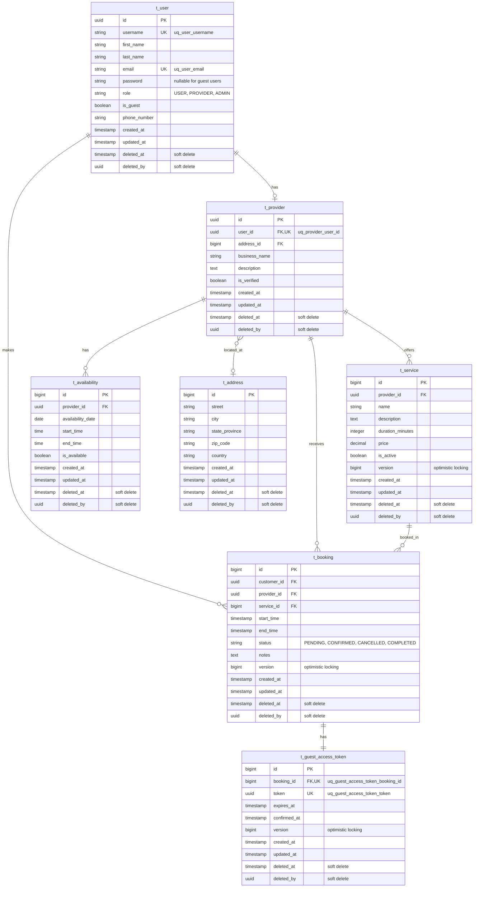

# Bookora

Modern booking system for personal services

## Tech Stack

- **Java 21**
- **Spring Boot 3.5.6**
- **Spring Security** - Authentication & Authorization
- **Spring Data JPA** - Data access layer
- **PostgreSQL** - Primary database
- **Flyway** - Database migrations
- **MapStruct** - Object mapping
- **Lombok** - Boilerplate code reduction
- **Hypersistence Utils** - Hibernate utilities
- **JWT (JJWT)** - Token-based authentication
- **Springdoc OpenAPI** - API documentation
- **Maven** - Build tool

## Prerequisites

- Java 21 or higher
- Maven 3.8+
- PostgreSQL 17

## Database Schema (ERD)



### Key Relationships

- **User-Provider**: One-to-one relationship. A user can become a provider.
- **User-Booking**: One-to-many. A customer (user) can make multiple bookings.
- **Provider-Service**: One-to-many. A provider offers multiple services.
- **Provider-Booking**: One-to-many. A provider receives multiple bookings.
- **Provider-Availability**: One-to-many. A provider defines multiple availability time slots.
- **Provider-Address**: Many-to-one. Multiple providers can share the same address (co-working spaces, business centers).
- **Service-Booking**: One-to-many. A service can be booked multiple times.
- **Booking-GuestAccessToken**: One-to-one. Each booking can have a guest access token for guest users.

### Schema Features

- **Soft Deletes**: All entities support soft deletion using `deleted_at` and `deleted_by` columns
  - Enables data retention and audit trail
  - @SQLRestriction automatically filters deleted records in queries
- **Optimistic Locking**: `version` column on `t_booking`, `t_service`, and `t_guest_access_token`
  - Prevents lost updates in concurrent scenarios
  - Uses @Version annotation for JPA-managed versioning
- **Guest User Support**:
  - `is_guest` flag distinguishes guest vs registered users
  - Guest users have nullable `password` field
  - Database constraint ensures guests cannot have passwords
- **Booking Conflict Prevention**:
  - Temporal range exclusion constraint prevents overlapping provider bookings
  - Customer exclusion constraint prevents double-booking for customers
  - Application-level + database-level validation for data integrity
- **Address Reusability**: Separate entity table for sharing addresses
  - Multiple providers can share the same address (co-working spaces, business centers)
  - Enables address history tracking via audit timestamps
  - Supports efficient location-based queries with indexed city/country columns

### Enums

- **UserRole**: `USER`, `PROVIDER`, `ADMIN`
- **BookingStatus**: `PENDING`, `CONFIRMED`, `CANCELLED`, `COMPLETED`

### Naming Conventions

- Tables: `t_<entity>` prefix
- Columns: `snake_case`
- Boolean columns: `is_<name>` prefix
- Timestamp columns: `<action>_at` suffix
- Unique constraints: `uq_<table>_<column>`

## Project Structure

```
src/main/java/fi/unfinitas/bookora
├── config
├── controller
├── domain
├── dto
├── exception
├── mapper
├── repository
├── security
├── service

src/main/resources
├── application.yml
└── db/migration
```

## Development

### Database Migrations

Flyway migrations are located in `src/main/resources/db/migration/`
